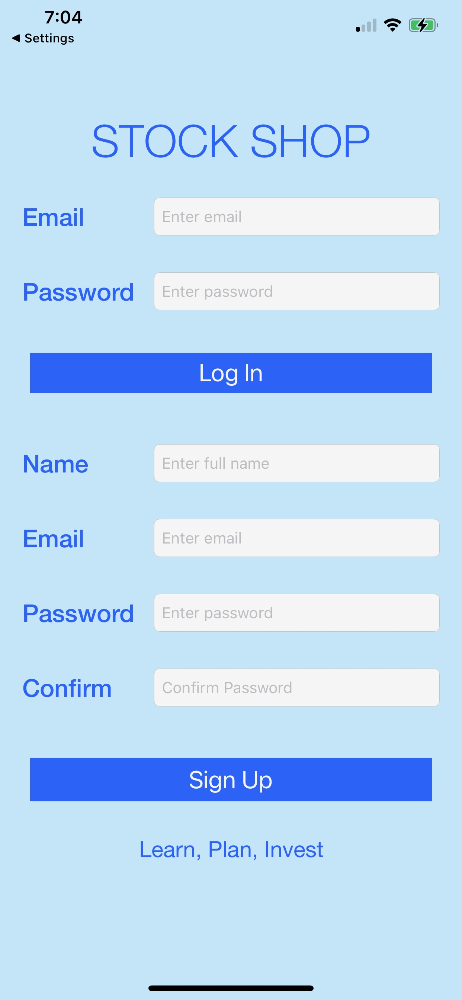

# Stock-Shop
Full stack iOS Application allowing users to create, calculate, and store stock option plays integrating MessageUI, EventKit, and UIKit for frontend functionality and Tiingo and HistoricalData API's for backend stock and options data aggregation.

When launching the app, users will be prompted to create an account or log in to their existing account.

