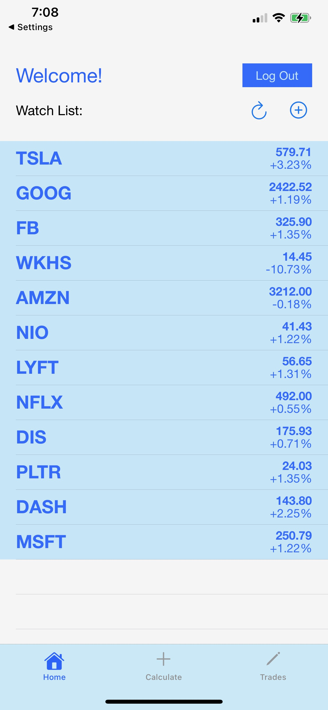

# Stock-Shop
Full stack iOS Application allowing users to create, calculate, and store stock option plays integrating MessageUI, EventKit, and UIKit for frontend functionality and Tiingo and HistoricalData API's for backend stock and options data aggregation.

When launching the app, users will be prompted to create an account or log in to their existing account. After logging in, the user will be directed to the home page, where they can see a list of stocks that they are interested in like a watchlist. They also have the option to click on each stock, allowing them to share, remind, or delete the stock from the list.

 
  
  
  

 

  

Users also have the option to search for a stock and then add it to our watchlist. In the example below, the user searches for a the Microsoft stock and then adds it to their own watchlist.

 
  
  
 

  

The calculate tab allows users to input data regarding target price (minimum, maximum) an confidence interval to calculate the optimal option to buy to maximize profit in the timemframe suggested. The views below show the calculate tab and how each play is store on the trades tab.

 
  
  
 

